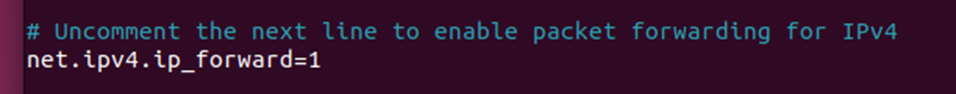
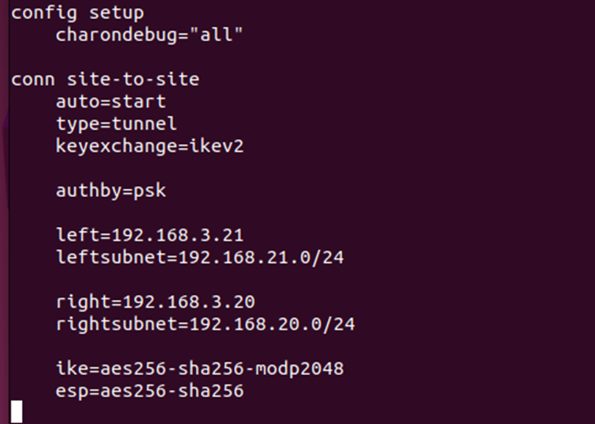
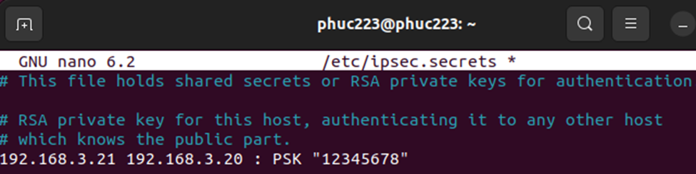
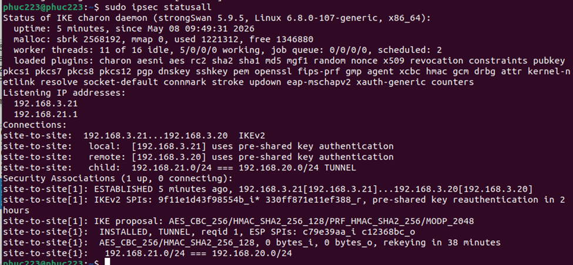
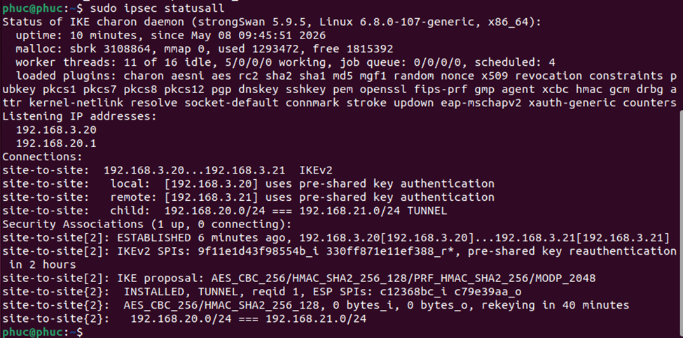
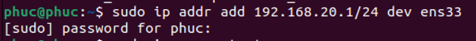
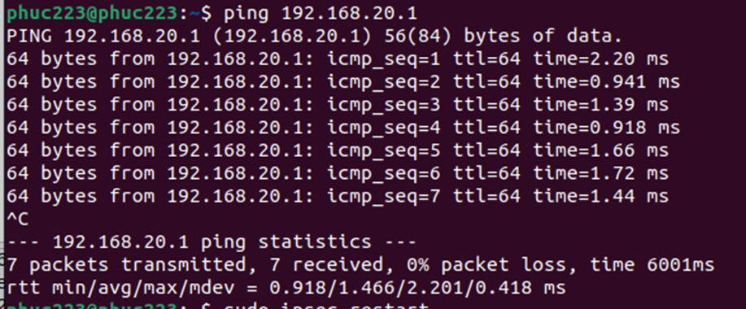
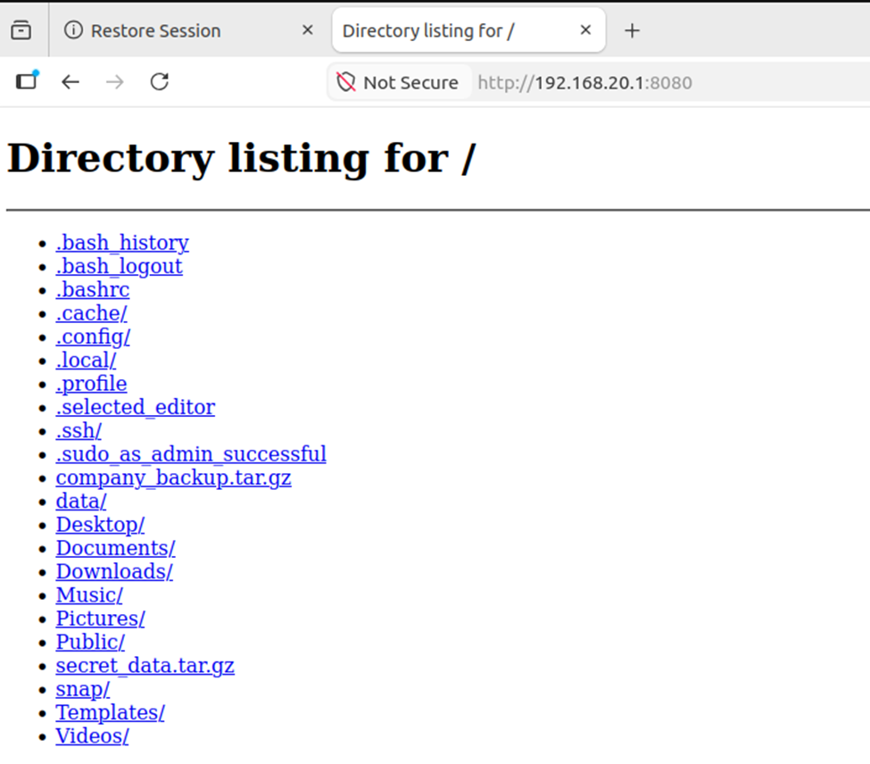
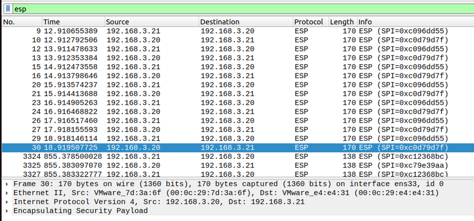
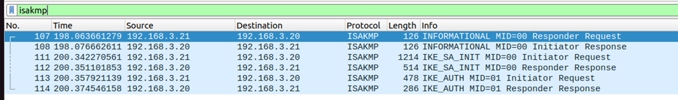

# Lý thuyết về VPN

## VPN là gì?

- **VPN (Virtual Private Network)** là mạng riêng ảo tạo kết nối an toàn giữa thiết bị và Internet.
- VPN mã hóa dữ liệu và ẩn địa chỉ IP để bảo vệ thông tin khi truy cập mạng công cộng.

## Lợi ích của VPN

- **Quyền riêng tư:** bảo vệ mật khẩu, thông tin cá nhân.
- **Ẩn danh:** che giấu IP và vị trí.
- **Bảo mật:** mã hóa dữ liệu, chống nghe lén.
- **Tiết kiệm chi phí:** kết nối từ xa rẻ hơn WAN/MPLS.

## VPN dùng để làm gì trong doanh nghiệp?

- Cho nhân viên làm việc từ xa an toàn.
- Kết nối các chi nhánh với nhau.
- Bảo vệ dữ liệu khi chuyển ứng dụng lên cloud.
- Tích hợp MFA/xác thực nhiều lớp.

## VPN dùng để làm gì cá nhân?

- Dùng Wi-Fi công cộng an toàn.
- Giấu lịch sử truy cập.
- Truy cập nội dung theo quốc gia khác.
- Bảo vệ danh tính online.

## VPN hoạt động thế nào?

- Tạo “đường hầm” mã hóa giữa thiết bị và máy chủ VPN.
- Dữ liệu được mã hóa trước khi gửi qua Internet.
- ISP hoặc hacker khó đọc được dữ liệu.

## Thành phần chính của VPN

- **VPN Client:** phần mềm trên máy người dùng.
- **VPN Server:** máy chủ nhận và giải mã dữ liệu.
- **VPN Protocol:** giao thức như OpenVPN, IPSec, WireGuard, IKEv2.

## Các loại VPN doanh nghiệp

- **Site-to-Site VPN:** kết nối nhiều chi nhánh.
- **Client VPN/OpenVPN:** người dùng từ xa truy cập mạng công ty.
- **SSL VPN:** truy cập qua trình duyệt web an toàn.

## Cách thiết lập VPN

- Dùng dịch vụ VPN có sẵn (NordVPN, ProtonVPN…).
- Cài VPN trên router để bảo vệ toàn bộ thiết bị.

## Chọn VPN như thế nào?

- Có chính sách không lưu log.
- Hỗ trợ giao thức mới như OpenVPN/WireGuard.
- Băng thông đủ lớn.
- Có server ở quốc gia cần dùng.

## VPN miễn phí vs Trả phí

### VPN miễn phí

- Chậm hơn.
- Ít server.
- Có thể bán dữ liệu/quảng cáo.
- Hỗ trợ kém.

### VPN trả phí

- Nhanh và ổn định hơn.
- Bảo mật tốt hơn.
- Nhiều server và tính năng hơn.

---

# Tổng quan về IPSec

## 1. Giới thiệu tổng quan về IPSec

**IPSec (Internet Protocol Security)** là một bộ chuẩn gồm các giao thức do IETF phê duyệt nhằm cung cấp các dịch vụ bảo mật cho lưu lượng IP:

- **Mục tiêu:** Cung cấp tính bí mật, toàn vẹn và xác thực thông tin giao tiếp giữa hai điểm trên mạng IP.
- **Vị trí hoạt động:** Bảo mật dữ liệu tại lớp 3 (Network) trong mô hình OSI hoặc lớp IP trong mô hình TCP/IP.
- **Ứng dụng:** Được sử dụng rộng rãi trong các mạng riêng ảo (VPN).

## 2. Giao thức AH (Authentication Header)

Giao thức AH tập trung vào việc xác thực mà không cung cấp tính bí mật (không mã hóa dữ liệu).

- **Chức năng chính:**
  - Cung cấp tính toàn vẹn dữ liệu và xác thực nguồn gốc dữ liệu.
  - Cung cấp dịch vụ bảo vệ chống phát lại (anti-replay) tùy chọn thông qua trường số thứ tự (Sequence Number).
- **Cơ chế hoạt động:**
  - Sử dụng các thuật toán băm như HMAC-MD5 hoặc HMAC-SHA kết hợp với khóa bí mật chung để tạo chuỗi đại diện thông điệp (digest).
  - **Phạm vi xác thực:** Xác thực toàn bộ gói IP, bao gồm cả tiêu đề IP bên ngoài (ngoại trừ các trường có thể thay đổi trong quá trình truyền).
- **Cấu trúc gói tin:** Tiêu đề AH được chèn vào giữa tiêu đề IP gốc và dữ liệu TCP/UDP.

## 3. Giao thức ESP (Encapsulating Security Payload)

ESP là giao thức linh hoạt hơn AH vì nó có thể cung cấp cả tính bí mật và xác thực.

- **Chức năng chính:**
  - **Tính bí mật:** Mã hóa gói IP bằng các hệ mật mã khóa đối xứng như DES, 3-DES, AES.
  - **Xác thực:** Đảm bảo tính toàn vẹn, xác thực nguồn gốc và chống phát lại thông qua hàm băm HMAC.
- **Cơ chế xác thực của ESP:** Khác với AH, xác thực ESP chỉ bao phủ phần dữ liệu (payload) của gói IP và tiêu đề ESP, không xác thực tiêu đề IP bên ngoài.
- **Cấu trúc gói tin:** Bao gồm tiêu đề ESP (ESP Header), dữ liệu đã mã hóa, phần đuôi ESP (ESP Trailer) và dữ liệu xác thực ESP (ESP Authentication).

## 4. Giao thức IKE (Internet Key Exchange)

IKE là giao thức quản lý khóa, có nhiệm vụ thiết lập môi trường an toàn trước khi dữ liệu được truyền đi.

- **Vai trò:** Sử dụng để sinh, trao đổi và duy trì các khóa mật mã dùng trong IPSec.
- **Cơ chế:** Sử dụng một biến thể của thuật toán trao đổi khóa Diffie-Hellman.
- **Phiên bản:** Hiện có IKEv1 và IKEv2.
- **Quá trình trao đổi (IKEv2):**
  - **Initial exchanges:** Trao đổi các thông số bảo mật ban đầu và khóa công khai Diffie-Hellman.
  - **CREATE_CHILD_SA:** Thiết lập các liên kết bảo mật (SA) cho IPSec sau khi đã có kênh kiểm soát an toàn.
- **Thông số quan trọng:** Sử dụng các chỉ mục SPI (Security Parameter Index) của bên khởi tạo và bên tiếp nhận để quản lý các liên kết bảo mật.

## 5. Các chế độ hoạt động của IPSec

Cả AH và ESP đều có thể hoạt động ở hai chế độ:

- **Chế độ vận chuyển (Transport mode):**
  - Chỉ bảo vệ phần dữ liệu (payload) của gói tin.
  - Giữ nguyên tiêu đề IP gốc.
  - **Ưu điểm:** Nhanh hơn do lượng dữ liệu thêm vào ít.
  - **Nhược điểm:** Kém an toàn hơn vì tiêu đề IP gốc không được bảo vệ.
- **Chế độ đường hầm (Tunnel mode):**
  - Bảo vệ toàn bộ gói tin ban đầu (bao gồm cả Header và Payload).
  - Gói tin cũ được đóng gói hoàn toàn vào trong một gói tin IP mới với tiêu đề mới.
  - **Ưu điểm:** Độ an toàn cao hơn, thường dùng cho kết nối giữa các Gateway (Site-to-Site VPN).
  - **Nhược điểm:** Chậm hơn do kích thước gói tin tăng lên.

## 6. Tổng quan về strongSwan

**Những điều cần lưu ý về strongSwan trong triển khai IPSec:**

- **Kiến trúc dựa trên IKEv2:** strongSwan là công cụ mạnh mẽ để triển khai giao thức IKE (Internet Key Exchange), đặc biệt là phiên bản IKEv2, nhằm mục đích sinh, trao đổi và duy trì các khóa mật mã trong IPSec.
- **Quản lý Security Association (SA):** strongSwan quản lý các kết nối logic một chiều (SA) giữa người gửi và người nhận thông qua chỉ mục SPI (Security Parameters Index).
- **Khả năng tương thích chế độ hoạt động:** strongSwan hỗ trợ cả hai chế độ Transport mode (chỉ bảo vệ payload, tốc độ nhanh) và Tunnel mode (đóng gói toàn bộ gói tin, độ an toàn cao hơn cho VPN).
- **Linh hoạt với các thuật toán mật mã:** Nền tảng này cho phép cấu hình đa dạng các thuật toán băm có khóa như HMAC-SHA2 hoặc AES-GMAC cho xác thực, và các thuật toán mã hóa như AES-GCM để đảm bảo tính bí mật.
- **Cơ chế xác thực thực thể:** strongSwan hỗ trợ xác thực bằng khóa công khai (public key) thông qua chứng chỉ số chuẩn X.509.

# Triển khai và Kiểm tra VPN Site-to-Site bằng IPsec

## 1. Tầm quan trọng của tính năng IP Forwarding

Trong hệ thống VPN Site-to-Site sử dụng IPsec, việc kích hoạt tham số `net.ipv4.ip_forward=1` trên hệ điều hành Linux đóng vai trò cốt lõi. Tham số này cho phép hệ điều hành thực hiện chức năng định tuyến (routing) và chuyển tiếp gói tin giữa các mạng khác nhau.

Theo mặc định, Linux chỉ xử lý các gói tin có đích đến là chính nó và sẽ loại bỏ các gói tin cần chuyển tiếp sang mạng khác. Khi `ip_forward` được bật, máy chủ có thể hoạt động như một router thực thụ: tiếp nhận dữ liệu từ mạng nội bộ (VD: Site A), đóng gói, mã hóa thông qua giao thức IPsec, và chuyển tiếp an toàn qua đường hầm (tunnel) VPN tới mạng đích (Site B).

Nhờ tính năng này, hai mạng LAN ở hai vị trí địa lý khác biệt có thể giao tiếp với nhau minh bạch và bảo mật như đang nằm chung trên một hạ tầng mạng nội bộ. Lưu ý rằng nếu bỏ qua cấu hình này, dù trạng thái tunnel VPN có thiết lập thành công, luồng dữ liệu vẫn sẽ không thể truyền tải thành công giữa hai site.



---

## 2. Cấu hình và Khởi động Dịch vụ IPsec

**Trên Site A:**
Tiến hành cấu hình IPsec:



**Phân tích file cấu hình:**

**1. Cấu hình chung (`config setup`)**

- `charondebug="all"`: Bật tất cả các bản tin log của daemon Charon (bộ phận xử lý IKE). Điều này giúp theo dõi chi tiết quá trình bắt tay IKE_SA_INIT và IKE_AUTH mà bạn đã thấy trong log Wireshark.

**2. Cấu hình kết nối (`conn site-to-site`)**
Đây là phần định nghĩa các chính sách bảo mật (Security Policy) cho đường hầm:

- **Chế độ và Giao thức:**
  - `type=tunnel`: Chế độ đường hầm (Tunnel mode). Toàn bộ gói tin IP ban đầu sẽ được đóng gói vào một gói tin IP mới để bảo mật tối đa.
  - `keyexchange=ikev2`: Sử dụng phiên bản IKEv2 để trao đổi khóa, giúp thiết lập kênh truyền nhanh và ổn định hơn.
  - `authby=psk`: Xác thực thực thể bằng bí mật chung (Pre-Shared Key) thay vì dùng chứng chỉ số X.509.

- **Địa chỉ và Mạng (Chính sách lưu lượng):**
  - `left` / `right`: Địa chỉ IP mặt ngoài của hai Gateway (192.168.3.21 và 192.168.3.20).
  - `leftsubnet` / `rightsubnet`: Các dải mạng nội bộ phía sau hai Gateway (192.168.21.0/24 và 192.168.20.0/24). Đây là đối tượng sẽ được bảo vệ bởi IPSec.

- **Các thuật toán mật mã (Cipher Suites):**
  - `ike=aes256-sha256-modp2048`: Thiết lập cho kênh kiểm soát (IKE SA). Sử dụng mã hóa AES-256, hàm băm SHA-256 và thuật toán trao đổi khóa Diffie-Hellman nhóm modp2048 (nhóm 14).
  - `esp=aes256-sha256`: Thiết lập cho kênh truyền dữ liệu (Child SA). Sử dụng giao thức ESP để vừa mã hóa (bí mật) vừa xác thực (toàn vẹn) dữ liệu bằng AES-256 và SHA-256.

Sau khi hoàn tất cấu hình, thực hiện khởi động lại dịch vụ StrongSwan để áp dụng:

```bash
sudo systemctl restart strongswan-starter
```

_(Lặp lại quy trình cấu hình và khởi động dịch vụ tương tự đối với Site B)._

---

## 3. Kiểm tra Trạng thái Đường hầm (Tunnel)

Sau khi cả 2 site đã cấu hình xong, ta tiến hành kiểm tra trạng thái hoạt động của đường hầm IPsec.

**Trạng thái trên Site A:**


**Trạng thái trên Site B:**


---

## 4. Giả lập Mạng LAN cho các Site

Để có môi trường mô phỏng kiểm tra, ta tiến hành tạo các card mạng ảo giả lập thành mạng LAN cho từng site.

**Khởi tạo mạng LAN trên Site A:**


**Khởi tạo mạng LAN trên Site B:**


---

## 5. Kiểm thử Giao tiếp và Bắt Gói tin

**Kiểm tra kết nối mạng cơ bản:**
Thực hiện lệnh PING từ Site A sang Site B để xác nhận kết nối thành công:


**Kiểm tra dịch vụ cấp ứng dụng (HTTP):**
Trên Site B, khởi động một máy chủ Web/HTTP Server nhẹ:


Từ Site A, thực hiện kết nối tới máy chủ HTTP vừa tạo trên Site B:


**Phân tích gói tin bằng Wireshark:**
Tiến hành bắt gói tin tại các cổng giao tiếp ngoài để phân tích.

- **Lọc gói tin với ESP:** Xác minh dữ liệu đã được mã hóa khi truyền qua kết nối IPsec.
  
- **Lọc gói tin với ISAKMP:** Quan sát quy trình trao đổi khóa và thiết lập kết nối (bắt tay IKE).
  

---

## 6. Kiểm chứng khi không có IPsec

Để khẳng định tính thiết yếu của kết nối này: Khi dịch vụ IPsec không được khởi chạy hoặc bị gián đoạn, từ máy LAN của Site A sẽ hoàn toàn không thể liên lạc (ping) đến máy LAN của Site B.


Link demo:
https://drive.google.com/file/d/1DCPDyuBfWNMd6UO5iLCGKKZSED2mOk-8/view?usp=sharing
