## Lab 2: Tấn công cạn kiệt tài nguyên DHCP Server (DHCP Starvation Attack)

### 1. Cấu hình DHCP Server

Thiết lập địa chỉ IP tĩnh cho DHCP Server:
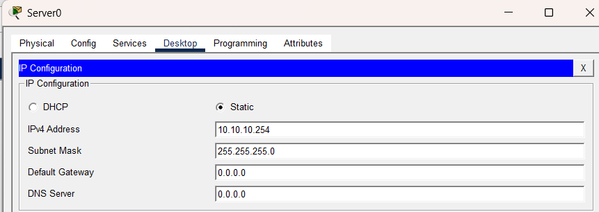

Tiếp theo, tiến hành cấu hình dịch vụ DHCP trên Server để cấp phát IP cho mạng:
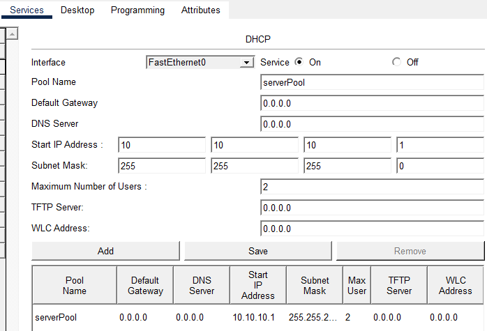

### 2. Hành vi của người dùng hợp lệ ban đầu

Trên máy người dùng (PC0), thực hiện yêu cầu cấp phát IP từ DHCP Server. Kết quả cho thấy PC0 nhận được IP thành công:
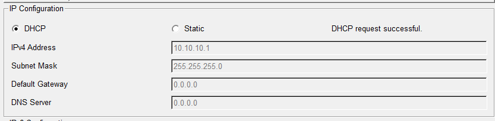

### 3. Thực hiện tấn công cạn kiệt tài nguyên DHCP (DHCP Starvation)

Sử dụng Laptop đóng vai trò Kẻ tấn công (Attacker), sử dụng công cụ tạo lưu lượng (traffic generator) để liên tục gửi các yêu cầu xin cấp phát IP với các địa chỉ MAC giả mạo (MAC Spoofing). Mục đích là làm cạn kiệt toàn bộ dải địa chỉ IP (pool) của DHCP Server.
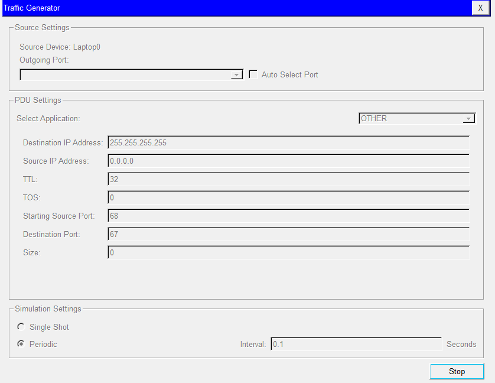

Kiểm tra lại việc xin cấp IP trên máy người dùng PC0, ta nhận thấy DHCP Server không còn địa chỉ IP nào trống để cấp phát thêm:
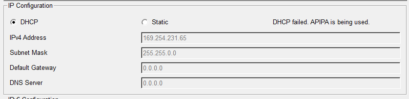
Qua đó, cuộc tấn công cạn kiệt tài nguyên DHCP đã diễn ra thành công, gây ra tình trạng từ chối dịch vụ (DoS) với người dùng hợp pháp.

### 4. Triển khai cấu hình phòng thủ (DHCP Snooping)

Để ngăn chặn tấn công này, ta cấu hình tính năng bảo mật trên Switch. Cụ thể:

- Thiết lập cổng kết nối với DHCP Server thực sự là cổng tin cậy (Trust Port).
- Thiết lập giới hạn tốc độ yêu cầu (Rate Limit) trên các cổng không tin cậy (Untrust Ports) còn lại để ngăn chặn việc gửi hàng loạt thông điệp DHCP Discover.
  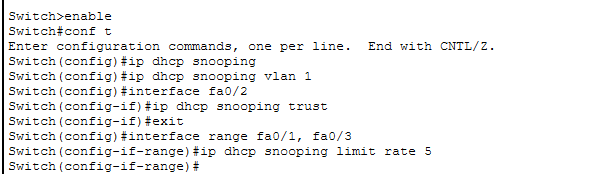

### 5. Kiểm tra và xác minh hệ thống

Trên PC0, thực hiện yêu cầu cấp phát IP lại và nhận thấy máy đã được cấp IP thành công từ DHCP Server:
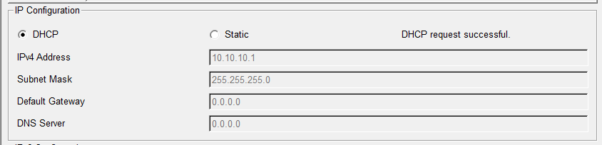

Tiếp tục sử dụng Attacker để thực hiện lại tấn công. Kết quả cho thấy máy PC0 vẫn có thể xin được địa chỉ IP bình thường vì gói tin rác từ Attacker đã bị Switch loại bỏ hoặc giới hạn. Qua đó khẳng định quá trình phòng thủ thành công hoàn toàn cho bài lab.

## Lab 4: Cấu hình Port Security

### 1. Mô hình mạng

Mô hình bài lab bao gồm Router, Switch và 2 máy tính (PC0, PC1).
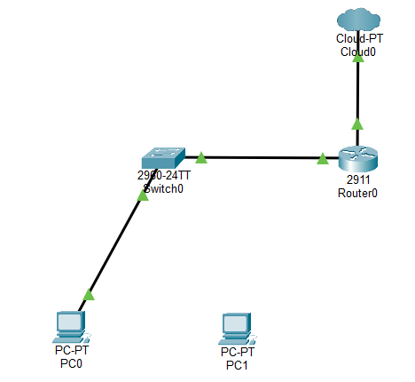

### 2. Thiết lập địa chỉ IP

- **Thiết lập IP cho PC0:**
  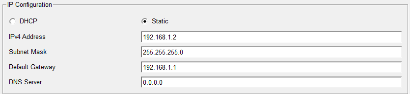
- **Thiết lập IP cho PC1:**
  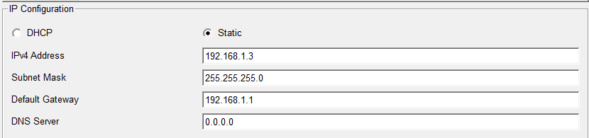
- **Địa chỉ IP của Router:** `192.168.1.1`

### 3. Cấu hình trên Router

Sau khi cài đặt địa chỉ IP và Subnet Mask cho Router, tiến hành bật các cổng kết nối đến Switch và Cloud:
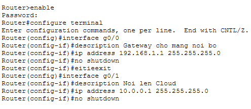

Kiểm tra trạng thái các cổng trên Router để đảm bảo cấu hình đã được áp dụng và cổng đã bật (Up):
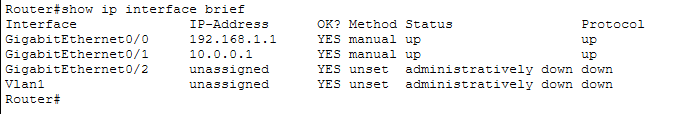

### 4. Cấu hình Port Security trên Switch

Trên Switch, ta tiến hành cấu hình Port Security tại cổng kết nối với PC (giả sử cổng Fa0/1) với các thông số:

- **Maximum 1:** Chỉ cho phép duy nhất 1 thiết bị (1 địa chỉ MAC) truy cập thông qua cổng này.
- **Mac-address sticky:** Switch tự động học và ghi nhớ vĩnh viễn địa chỉ MAC của thiết bị đầu tiên kết nối vào cổng.
- **Violation shutdown:** Khi phát hiện thiết bị khác có địa chỉ MAC không khớp kết nối vào, cổng sẽ lập tức bị đóng chặn (Shutdown).

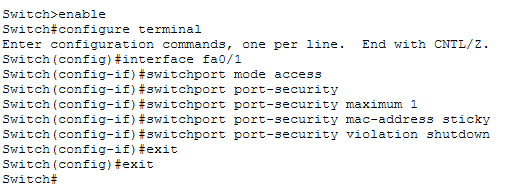

### 5. Kiểm tra và xác minh hệ thống

**Bước 5.1: Ghi nhận địa chỉ MAC hợp lệ (PC0)**
Từ PC0, tiến hành gửi gói tin ping đến địa chỉ IP của Router (`192.168.1.1`). Mục đích là để kích hoạt luồng dữu liệu, giúp Switch học được địa chỉ MAC của PC0.
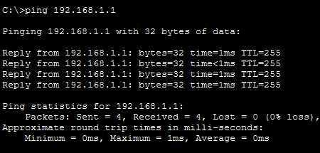

Kiểm tra trên Switch, cấu hình đã lưu lại địa chỉ MAC của PC0 thông qua tính năng Sticky MAC:
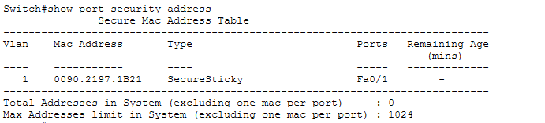

**Bước 5.2: Kiểm tra chế độ tự động chặn thiết bị lạ (PC1)**
Giả lập tấn công hoặc thay đổi thiết bị trái phép bằng cách rút dây mạng từ PC0 và cắm sang PC1:
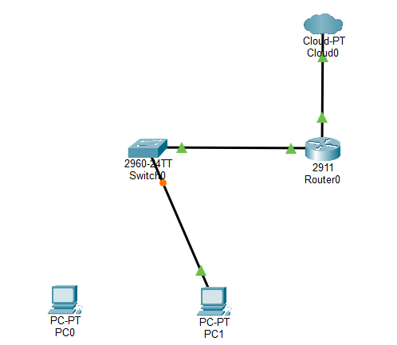

Từ PC1, thực hiện ping tới Router. Kết quả trả về cho thấy ping thất bại (Destination host unreachable / Request timed out), PC1 đã bị hệ thống chặn kết nối.
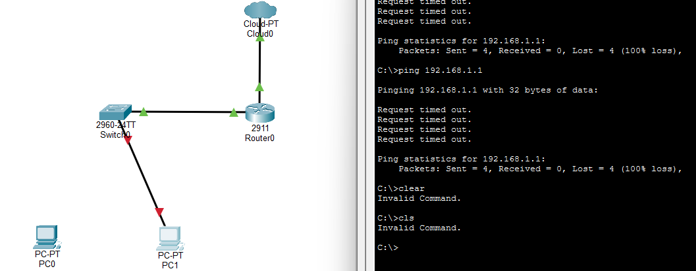

Trên CLI của Switch, ta nhận được log cảnh báo cổng đã bị chuyển sang trạng thái đóng lập tức (line protocol down).
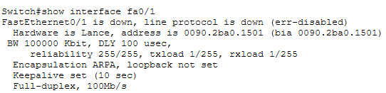

Sử dụng lệnh kiểm tra chi tiết tham số Port Security trên cổng đó (Ví dụ: `show port-security interface fa0/1`), ta thấy số lần vi phạm `Security Violation Count` tăng lên và trạng thái cổng (Port Status) biến thành `Secure-down`.
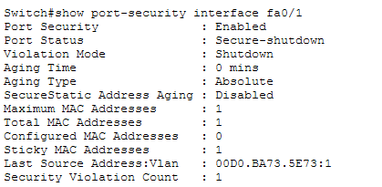

### 6. Kết luận

Bài lab đã triển khai thành công cơ chế **Port Security** kích hợp tính năng **Sticky MAC**. Giải pháp giúp Switch có khả năng tự động nhận diện và chỉ cấp quyền mạng cho thiết bị hợp pháp đầu tiên (PC0). Đồng thời, hệ thống chủ động ngăn chặn và phòng thủ hiệu quả trước mọi sự truy cập trái phép của thiết bị lạ (PC1) bằng cơ chế tự động khóa cổng (Shutdown) khi có thay đổi phần cứng vi phạm chính sách bảo mật mạng.

## Lab 5: Cấu hình Dynamic ARP Inspection DAI

Trên Router DHCP, cấu hình IP cho cổng kết nối với Switch và cấu hình Pool DHCP để cấp IP cho các máy khác
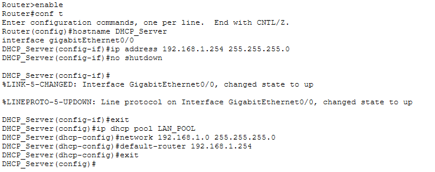
Trên Router Host, cấu hình nhận IP tự động từ DHCP Server
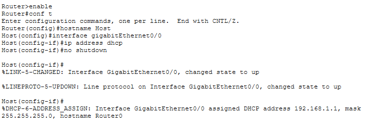
Kiểm tra ta thấy Router Host đã nhận IP được cấp phát từ DHCP server
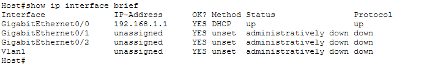
Trên Router Attack, đặt IP tĩnh để giả lập việc một kẻ tấn công tự ý cắm vào mạng và đặt IP trái phép mà không thông qua DHCP Server
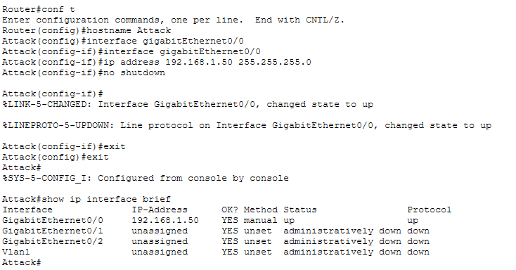
Trên Switch, bật Snooping toàn cục và cho VLAN 1
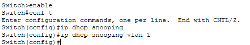
Thiết lập cổng tin cậy đối với Router DHCP
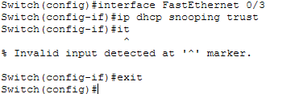
Tiếp theo kích hoạt Dynamic ARP Inspection (DAI)
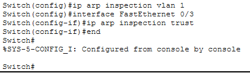
Kiểm tra:
Trên Router Host, ping tới Router DHCP. Kết quả ping thành công vì Host nhận IP hợp lệ từ DHCP, Switch đã lưu thông tin này và cho phép gói tin ARP đi qua
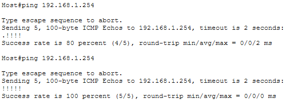
